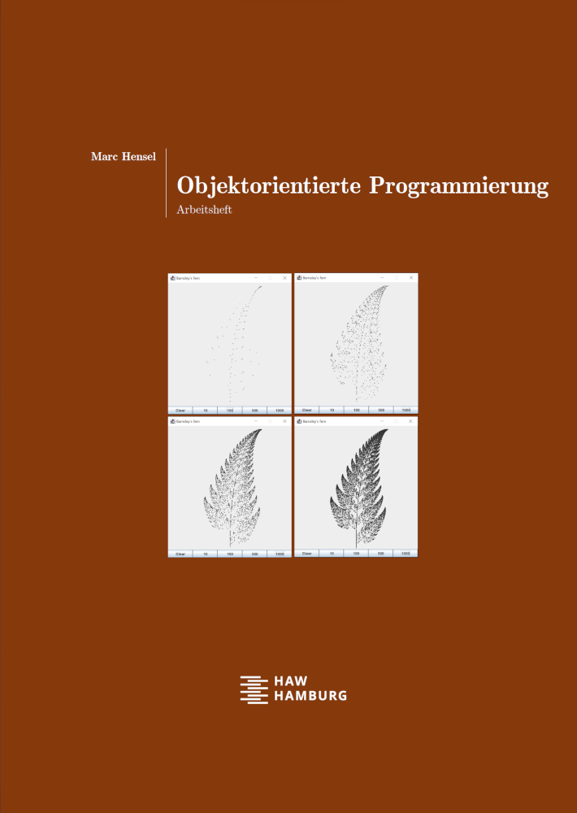

# Java programing workbook and sample codes

Teaching at Hamburg University of Applied Sciences (HAW Hamburg) since 2010, I have created lots of material for my students over the years. For software development this includes sample codes used in lecture as well as __workbooks__ meant to apply, apply, and apply by practical coding. In the end it is all about building up practical competencies to be prepared for your profession - meaning, one must be able to _do things_, in contrast to merely _knowing_.

This raised the question, why not share material with ... well, _you_, for instance, in case you find it helpful for your students or yourself. So this is exactly what I do.
 

## Overview
- The workbook contains a large number of exercises (with [sample solutions](src/workbook)), questions, and extensive lab assignments (with provided files).
- I am aware that the lecture [sample codes](src/lecture) would be far more valuable with the lecture slides provided. This may follow in future.
- Source codes are provided as projects for the IDE [IntelliJ IDEA Community](https://www.jetbrains.com/idea/).

## Upload status (uploaded or still to come)
- [ ] Workbook (German)
- [X] [Sample codes](src/lecture) used in the lecture
- [X] [Sample solutions](src/workbook) for the exercises
- [ ] Provided files for lab assignments
- [ ] Lecture slides (German)

## Contact
Marc Hensel, University of Applied Sciences Hamburg (HAW Hamburg)

http://www.haw-hamburg.de/marc-hensel
